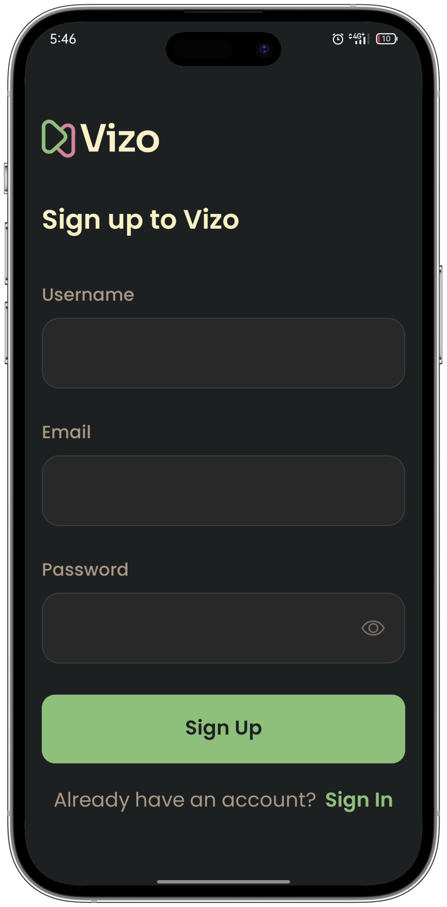
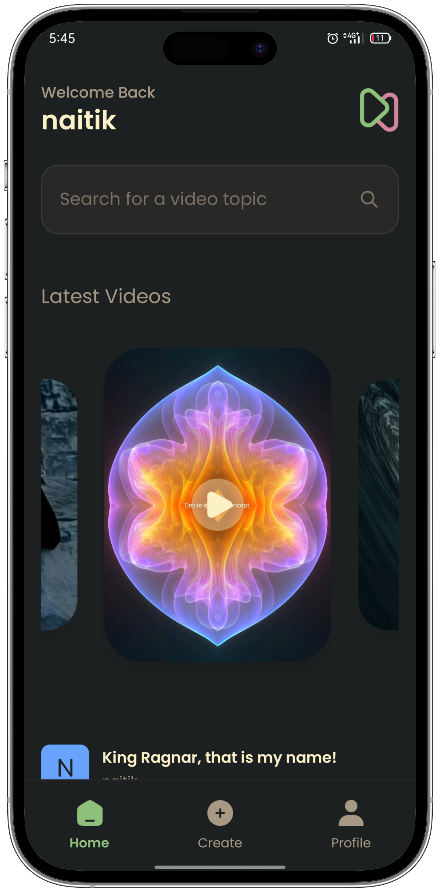
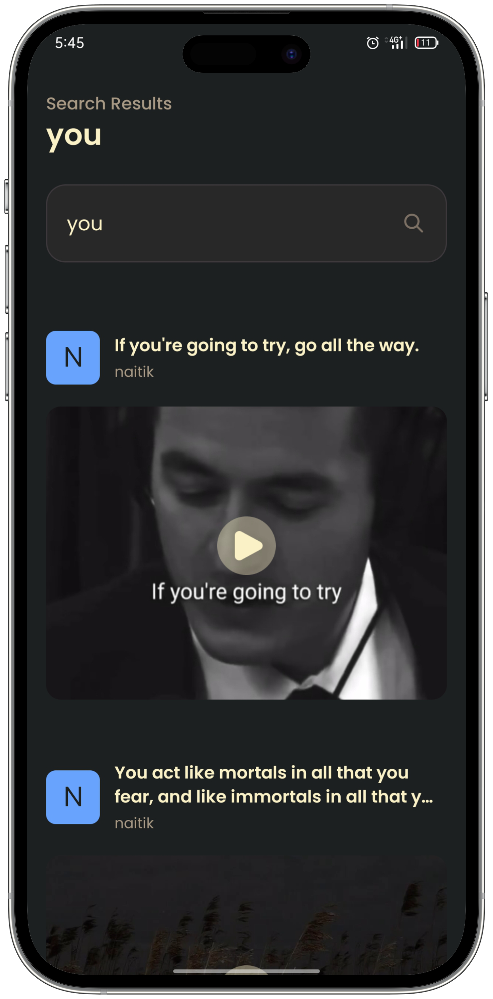
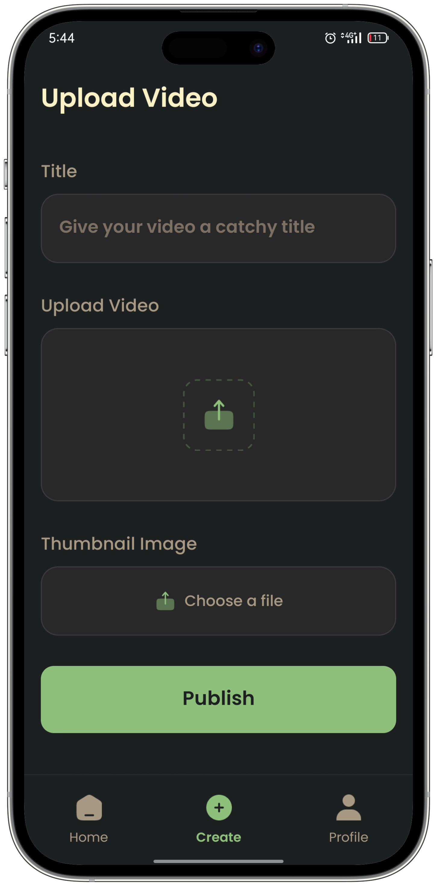
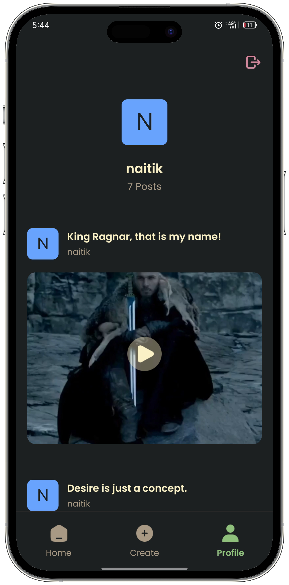

#  Vizo

Vizo is a video sharing app that allows users to upload videos and watch content from other users.

### Screenshots








### Tech Stack

[](https://reactnative.dev)
[](https://expo.dev)
[](https://appwrite.io)
[](https://www.nativewind.dev)

### Quick Start

Follow these steps to set up the project locally on your machine.

**Prerequisites**

Make sure you have the following installed on your machine:

- [Git](https://git-scm.com)
- [Node.js](https://nodejs.org/en)
- [npm](https://www.npmjs.com)

**Cloning the Repository**

```bash
git clone https://github.com/n4itik/Vizo.git
cd Vizo
```

**Installation**

Install the project dependencies using npm:

```bash
npm install
```

**Running the Project**

```bash
npm start
```

**Expo Go**

Download the [Expo Go](https://expo.dev/go) app onto your device, then use it to scan the QR code from Terminal and run.

### Acknowledgment

[JS Mastery](https://www.youtube.com/@javascriptmastery)
